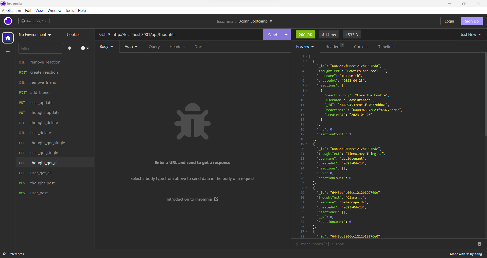

# social-network-api

## Description

This application is an API for a social network web application where users can share their thoughts, react to friends’ thoughts, and create a friend list. It uses Express.js for routing, a MongoDB database, and the Mongoose ODM.

Click the image below to see a demo of the application.

## Table of Contents
- [Description](#description)
- [Installation](#installation)
- [Usage](#usage)
- [Contributing](#contributing)
- [Questions](#questions)

## Installation
In order to install express, mongoose, and nodemone, please use:  
npm i

## Usage
AS A social media startup, I want an API for my social network that uses a NoSQL database so that my website can handle large amounts of unstructured data.

The application will be invoked by using the following command: 
npm start

## Contributing
Thank you for your interest in my project. I am excited to see your contributions. Please follow the [Contributor Covenant](https://www.contributor-covenant.org/).

## Questions
If you have additional questions, please email me at bsimmonds28@gmail.com.
To see more of my work, find me on GitHub at [bsimmonds28](https://github.com/bsimmonds28)!

